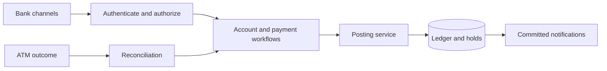

# Banking System · UML Design

A design study of retail banking: customer accounts, internal transfers, branch cash operations, ATM withdrawals, fixed deposits, cheques, loans and staff responsibilities.

This repository contains **design documentation**, not a deployed banking application. The revised model focuses on financial consistency and clear failure handling. Original StarUML coursework is preserved separately. No frontend has been added.

## Design at a glance

The design covers customer accounts, internal transfers, cash operations, ATM withdrawals, deposits, cheques and loans. One posting service owns financial journals; other workflows request postings rather than changing balances independently.

- **Transfers:** matching request keys return the same result; balanced postings and the result commit together.
- **ATM withdrawals:** reserve funds first. Settle a confirmed dispense, release a confirmed failure, and reconcile an uncertain outcome.
- **Loans:** document verification, approval and disbursement are separate steps.
- **Audit:** financial journals are immutable; corrections use reversals. Notifications follow a committed outbox.

Scope: one bank, internal same-currency transfers and one transactional database. This is a design study; the acceptance scenarios describe expected behavior for a future implementation.

## Read the design

| Document | Purpose |
| --- | --- |
| [Design views](docs/design.md) | Nine diagram categories, split into fourteen readable diagrams |
| [Requirements and scenarios](docs/requirements.md) | Twelve rules, authorization boundaries and eighteen acceptance scenarios |
| [Design decisions](docs/decisions.md) | Architecture choices, examples and limits |
| [Mermaid sources](docs/diagrams/) | Editable sources for every revised diagram |
| [Original coursework](original/) | Historical StarUML files and Word document |

## Domain and ledger models

[Domain classes](docs/design.md#domain-classes) describe customer ownership, accounts, products and staff. [Ledger classes](docs/design.md#ledger-and-request-classes) describe journals, postings, holds, requests and audit records. They are split for readability.

Customer balances derive from posted ledger entries and active holds. For a same-currency transfer, the source deposit liability is debited and the destination deposit liability credited equally. Financial journals and operational audit events serve different purposes.

## Scope and limitations

The design assumes one bank and internal same-currency transfers. It chooses a modular application with one transactional relational database; it does not claim distributed atomicity with a physical ATM or external settlement system.

Original files in [`original/`](original/) are historical and are **not synchronized** with the revised model. The retained legacy class image is labelled accordingly. Mermaid flowcharts approximate use-case, communication, component, deployment and package views; they are not formal UML interchange files.

The acceptance scenarios specify expected future implementation behaviour. They have not been executed against a banking application. Jurisdiction-specific compliance, production availability, deployment configuration and recovery objectives remain decisions for a real implementation.

## Validation

The diagram sources are checked with Mermaid's parser, and documentation/source consistency, local links and requirements/scenario IDs are checked separately. Validation concerns the design artifacts; it is not proof that a banking system has been implemented or tested.

Use [Mermaid's documentation](https://mermaid.js.org/intro/) for editing the sources, or open the historical `.mdj` files in StarUML to inspect the original coursework.
