# Banking System: UML Design

A UML design for the core system of a retail bank branch. It covers customers and staff, savings, current and fixed deposit accounts, cash and transfers, cheques, ATM withdrawals and loans. It was drawn for a university software engineering course in 2022 and revised in 2026, so that all nine diagrams describe the same system with the same names.

This is a design, not an implementation. Every diagram below is written in [Mermaid](https://mermaid.js.org/) and renders directly on GitHub. The class diagram is too large for GitHub's viewer, so it is shown as an image, with its Mermaid source underneath. The original StarUML files are kept in [`original/`](original/).

**Contents**

1. [Use case diagram](#1-use-case-diagram)
2. [Class diagram](#2-class-diagram)
3. [Sequence diagrams](#3-sequence-diagrams)
4. [Communication diagram](#4-communication-diagram)
5. [State machine diagrams](#5-state-machine-diagrams)
6. [Activity diagrams](#6-activity-diagrams)
7. [Component diagram](#7-component-diagram)
8. [Deployment diagram](#8-deployment-diagram)
9. [Package diagram](#9-package-diagram)

## Actors

| Actor | Role |
| --- | --- |
| Customer | Holds accounts, uses the counter, ATM and internet banking |
| Receptionist | First point of contact; checks slips and forwards requests |
| Cashier | Handles cash deposits, withdrawals and cheques at the counter |
| Accountant | Keeps account records, verifies loan documents |
| Branch Manager | Approves loans and sets branch products and rates |
| Administrator | Manages staff and system access |

## 1. Use case diagram

What each actor can do. Every staff and customer use case requires the user to be logged in (`include`); the ATM authenticates with card and PIN instead.

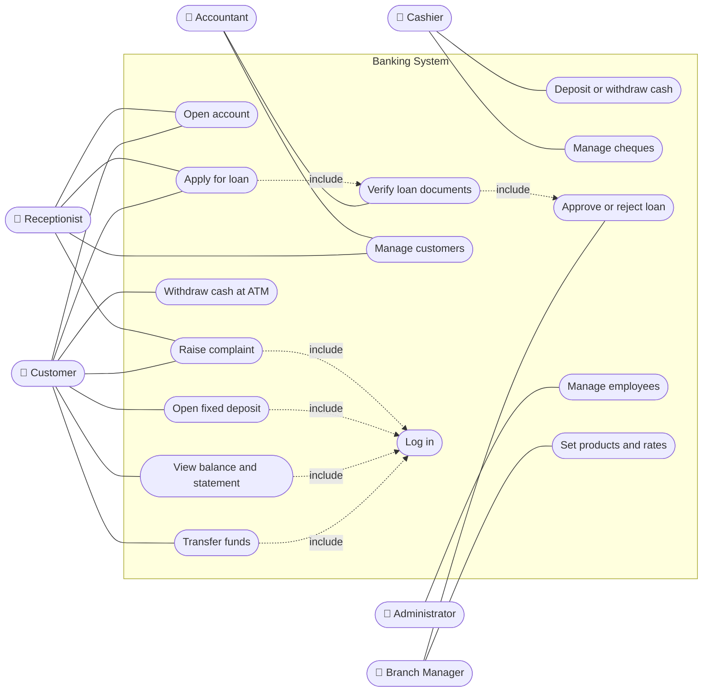

## 2. Class diagram

The domain model. `Account` is abstract, and every change to a balance is recorded as a `Transaction`, so the statement is always the full history.

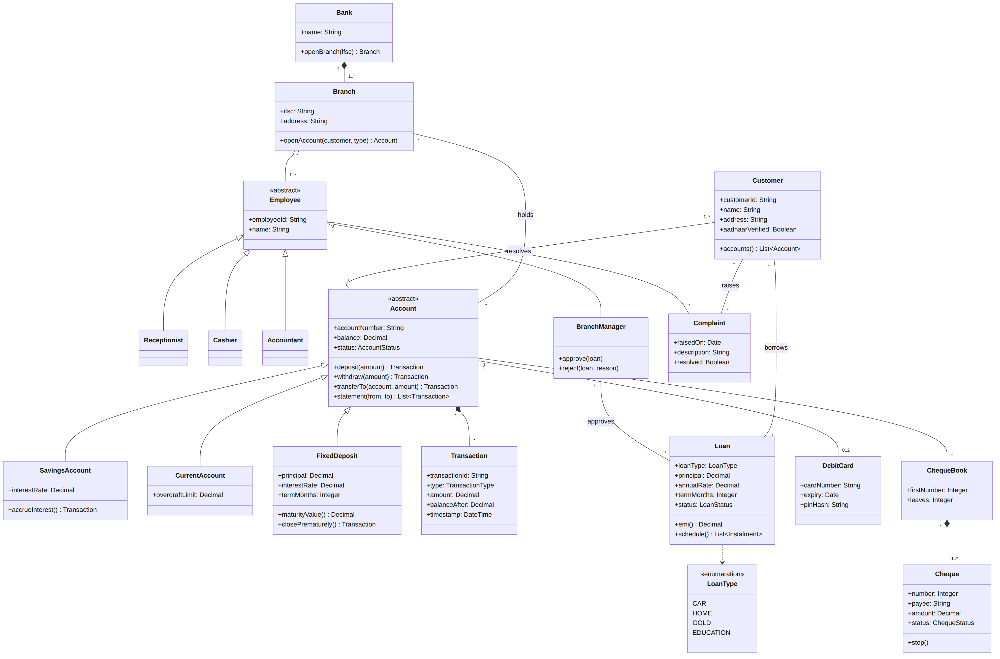

<details>
<summary>Mermaid source</summary>

The same diagram as text, also in [`docs/class-diagram.mmd`](docs/class-diagram.mmd).

```text
classDiagram
    direction TB
    class Bank {
        +name: String
        +openBranch(ifsc) Branch
    }
    class Branch {
        +ifsc: String
        +address: String
        +openAccount(customer, type) Account
    }
    class Customer {
        +customerId: String
        +name: String
        +address: String
        +aadhaarVerified: Boolean
        +accounts() List~Account~
    }
    class Employee {
        <<abstract>>
        +employeeId: String
        +name: String
    }
    class Receptionist
    class Cashier
    class Accountant
    class BranchManager {
        +approve(loan)
        +reject(loan, reason)
    }
    class Account {
        <<abstract>>
        +accountNumber: String
        +balance: Decimal
        +status: AccountStatus
        +deposit(amount) Transaction
        +withdraw(amount) Transaction
        +transferTo(account, amount) Transaction
        +statement(from, to) List~Transaction~
    }
    class SavingsAccount {
        +interestRate: Decimal
        +accrueInterest() Transaction
    }
    class CurrentAccount {
        +overdraftLimit: Decimal
    }
    class FixedDeposit {
        +principal: Decimal
        +interestRate: Decimal
        +termMonths: Integer
        +maturityValue() Decimal
        +closePrematurely() Transaction
    }
    class Transaction {
        +transactionId: String
        +type: TransactionType
        +amount: Decimal
        +balanceAfter: Decimal
        +timestamp: DateTime
    }
    class ChequeBook {
        +firstNumber: Integer
        +leaves: Integer
    }
    class Cheque {
        +number: Integer
        +payee: String
        +amount: Decimal
        +status: ChequeStatus
        +stop()
    }
    class DebitCard {
        +cardNumber: String
        +expiry: Date
        +pinHash: String
    }
    class Loan {
        +loanType: LoanType
        +principal: Decimal
        +annualRate: Decimal
        +termMonths: Integer
        +status: LoanStatus
        +emi() Decimal
        +schedule() List~Instalment~
    }
    class Complaint {
        +raisedOn: Date
        +description: String
        +resolved: Boolean
    }
    class LoanType {
        <<enumeration>>
        CAR
        HOME
        GOLD
        EDUCATION
    }

    Bank "1" *-- "1..*" Branch
    Branch "1" o-- "1..*" Employee
    Branch "1" -- "*" Account : holds
    Employee <|-- Receptionist
    Employee <|-- Cashier
    Employee <|-- Accountant
    Employee <|-- BranchManager
    Customer "1..*" -- "*" Account : owns
    Account <|-- SavingsAccount
    Account <|-- CurrentAccount
    Account <|-- FixedDeposit
    Account "1" *-- "*" Transaction
    Account "1" -- "*" ChequeBook
    ChequeBook "1" *-- "1..*" Cheque
    Account "1" -- "0..2" DebitCard
    Customer "1" -- "*" Loan : borrows
    Loan ..> LoanType
    BranchManager "1" -- "*" Loan : approves
    Customer "1" -- "*" Complaint : raises
    Employee "1" -- "*" Complaint : resolves
```

</details>

## 3. Sequence diagrams

**Cash deposit or withdrawal at the counter.** The receptionist checks the slip before it reaches the cashier, and a withdrawal is refused if the balance is too low.

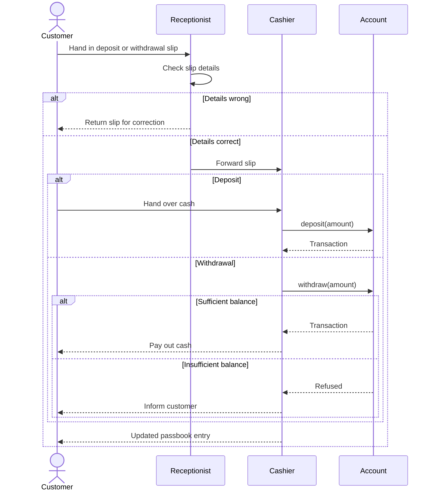

**Loan application.** The accountant verifies documents; only the branch manager can approve.

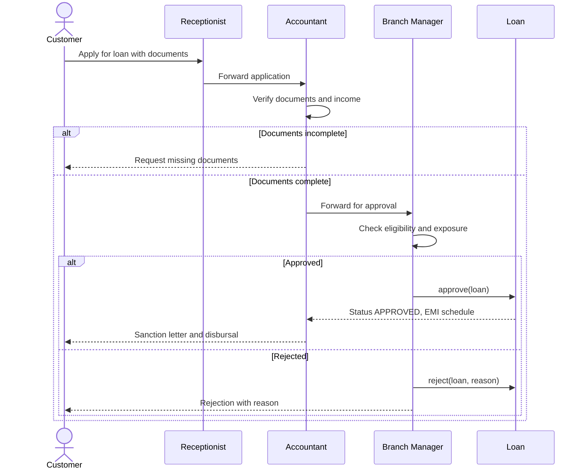

## 4. Communication diagram

**Cash withdrawal at an ATM.** The numbers give the order of messages between the customer, the ATM and the bank's server. Mermaid has no communication-diagram type, so this is drawn as a graph with numbered edges.

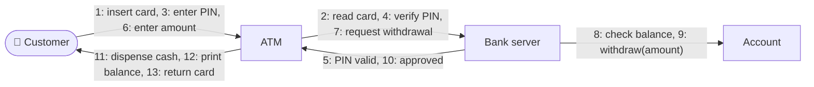

## 5. State machine diagrams

**Cheque.** A cheque deposited for clearing is either paid or returned.

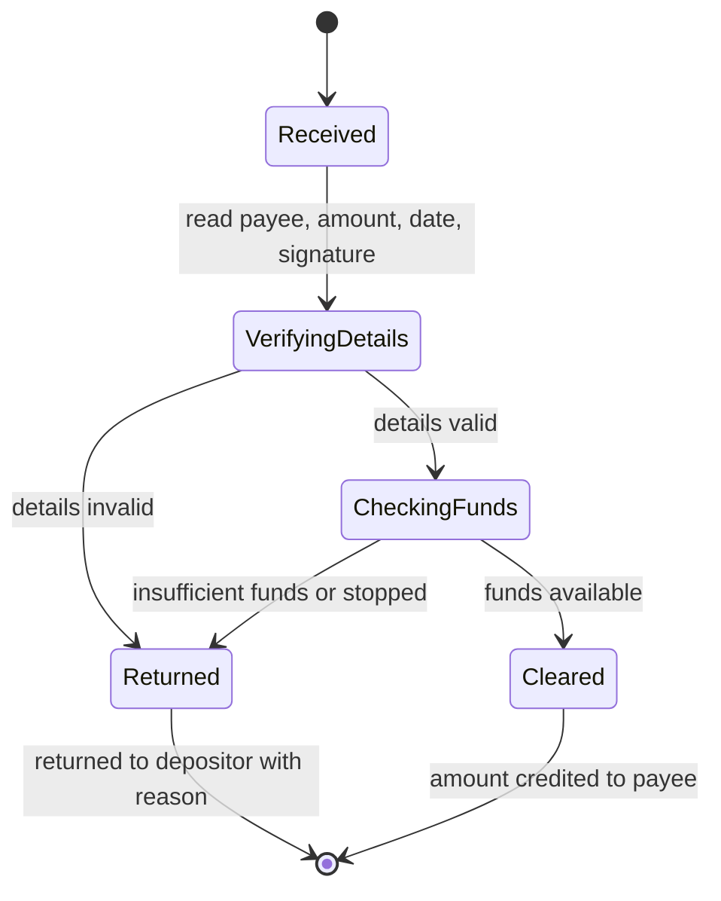

**Loan.** A loan moves through application, approval and repayment; a missed payment makes it overdue until it is brought current or written off.

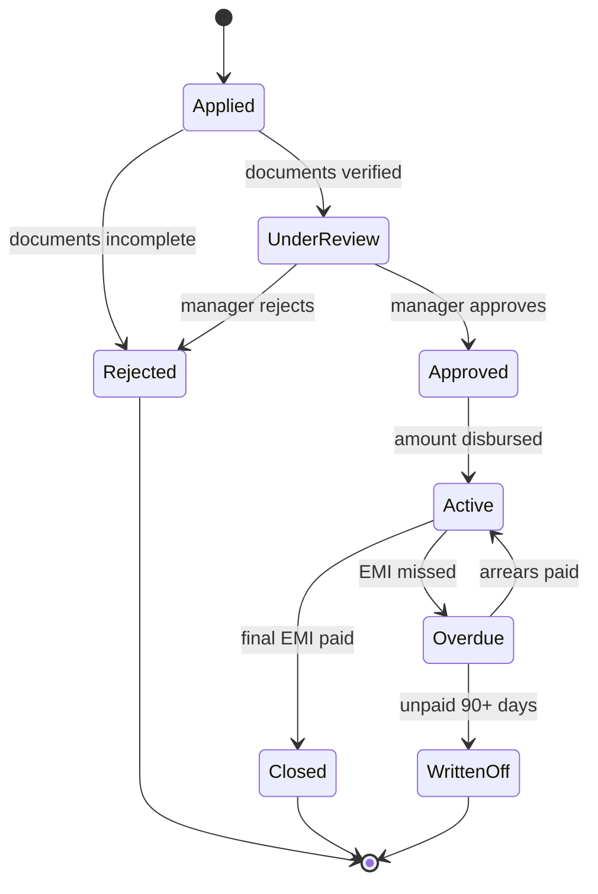

## 6. Activity diagrams

**Internet banking session.** A user gets three login attempts before the account is locked.

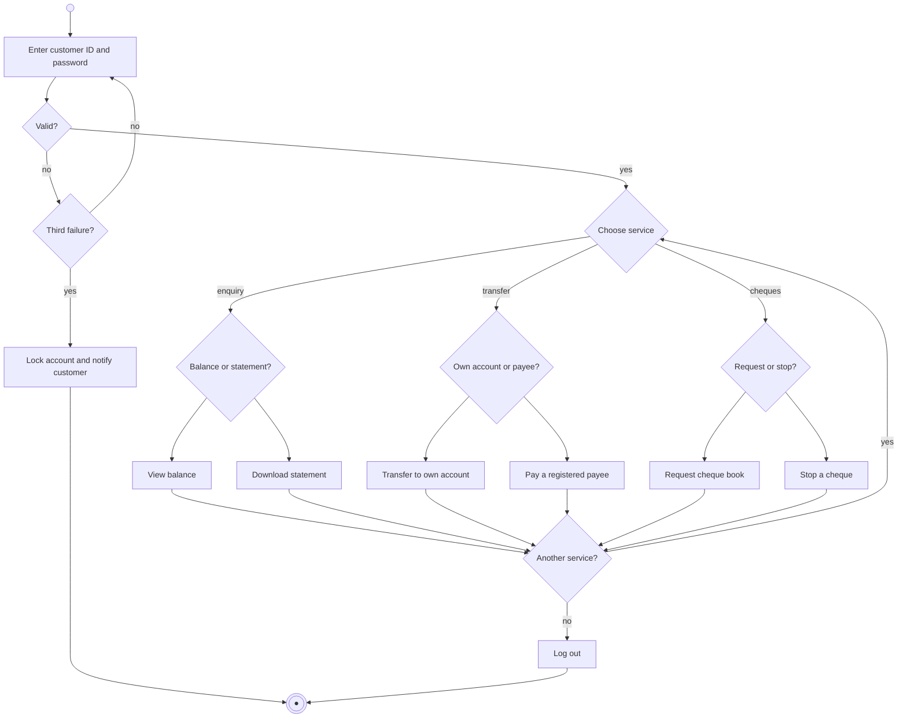

**Loan application.** Document checks run in parallel; the loan is priced only once all are complete.

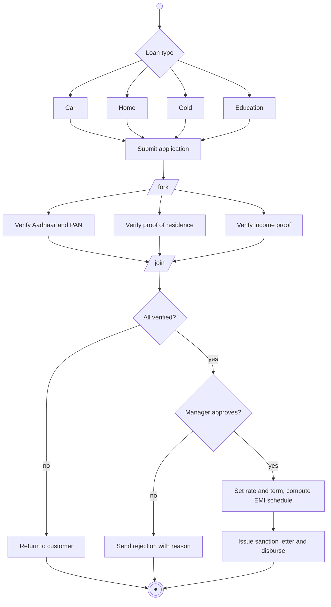

## 7. Component diagram

The application is split by business area. Every module reaches the database only through the persistence layer, and only after the security component has checked access.

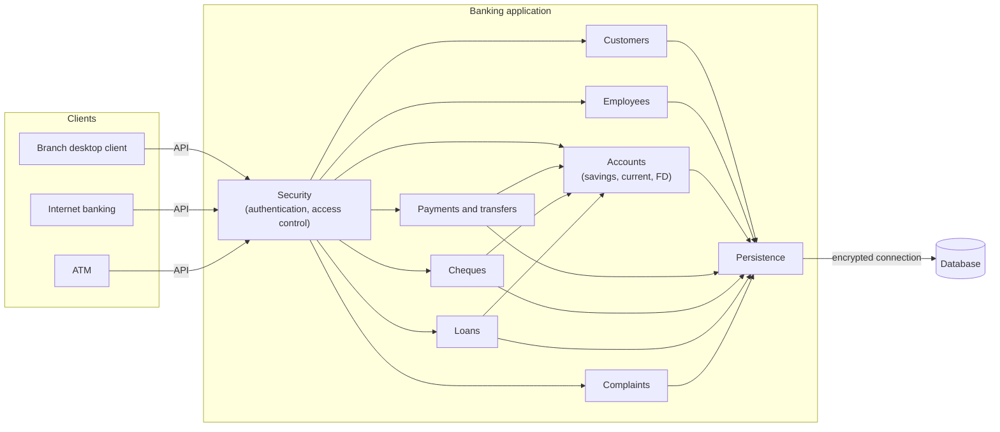

## 8. Deployment diagram

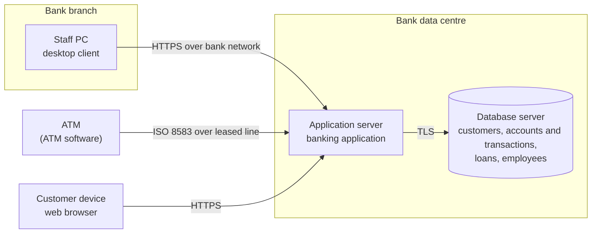

## 9. Package diagram

Dashed arrows show which package depends on which. Products and payments depend on the core, and nothing depends on the user interface.

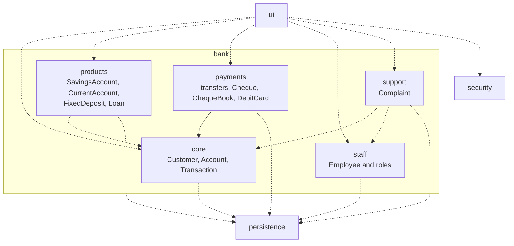

## Changes from the 2022 version

The original diagrams were drawn separately and did not agree with each other. This revision:
- **Class diagram:** it had only Bank, Account, Client and a savings subclass. It now includes every concept the other diagrams use: branches, staff roles, current accounts, fixed deposits, transactions, cheques, cards, loans and complaints.
- **Use case diagram:** removed use cases that inherited from "log in" and actors associated with themselves; "log in" is now included where it's needed.
- **State machine diagrams:** the staff roles drawn as states were replaced by the life cycles of a cheque and a loan.
- **Communication diagram:** the ATM withdrawal was split from the unrelated branch-reception messages.
- **Clean-up:** removed placeholder names (Class1, UseCase16, Interface1–5, Component1–2, Package9) and fixed spelling.
- **Format:** the diagrams are now written as text, so they can be read and reviewed on GitHub without StarUML.
