# Banking design views

These are the revised, canonical design views. Original StarUML files are preserved as historical source material; they have not been synchronized to this revision. Requirements and acceptance scenarios are in [requirements.md](requirements.md).

## Design at a glance

The design covers customer accounts, internal transfers, cash operations, ATM withdrawals, deposits, cheques and loans. One posting service owns financial journals; other workflows request postings rather than changing balances independently.

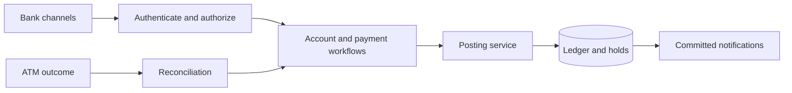

- **Transfers:** matching request keys return the same result; balanced postings and the result commit together.
- **ATM withdrawals:** reserve funds first. Settle a confirmed dispense, release a confirmed failure, and reconcile an uncertain outcome.
- **Loans:** document verification, approval and disbursement are separate steps.
- **Audit:** financial journals are immutable; corrections use reversals. Notifications follow a committed outbox.

Scope: one bank, internal same-currency transfers and one transactional database. This is a design study; the acceptance scenarios describe expected behavior for a future implementation.

---

## Detailed views

## Use cases

This is a use-case relationship map drawn with Mermaid flowchart syntax, not formal UML include/extend notation. Authentication is a precondition for protected actions; approval is not implicitly part of document verification.

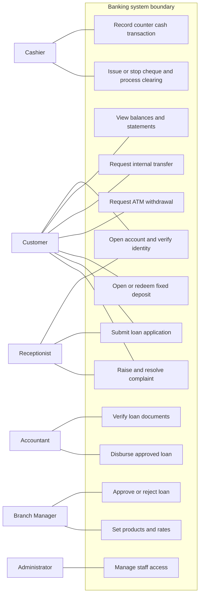

[Diagram source](diagrams/01-use-cases.mmd)

## Domain classes

Account ownership is explicit, including joint-account signing policy. Fixed deposits are separate term products rather than unrestricted withdrawal accounts. Product policies determine overdraft eligibility. Amounts use integer minor units and an explicit currency; rates use decimal arithmetic.

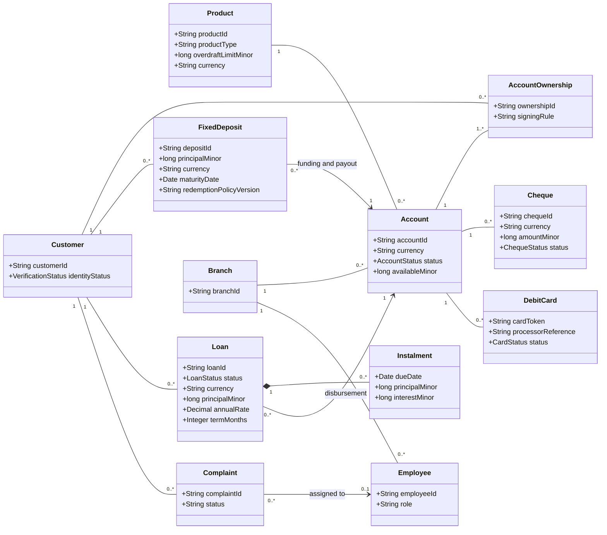

[Diagram source](diagrams/02-domain-classes.mmd)

## Ledger and request classes

Ledger accounts include customer deposit liabilities and bank control accounts. An entry contains at least two positive postings, balanced by currency. Statements are derived from committed postings. Audit events are separate from financial journals; requests can fail without creating a journal.

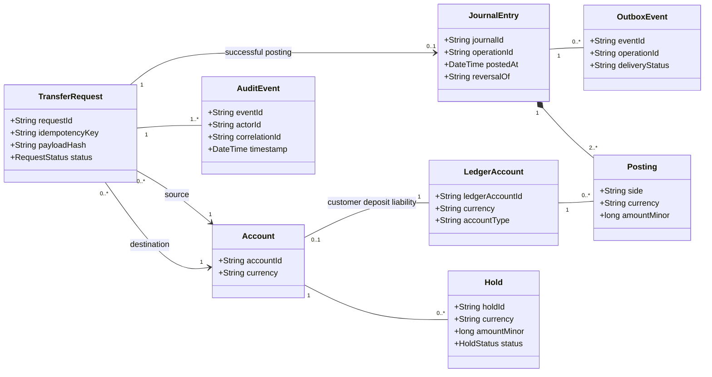

[Diagram source](diagrams/02-ledger-classes.mmd)

## Internal transfer sequence

Same-bank, same-currency transfers commit both postings, the request result, audit and outbox in one database transaction. Durable idempotency keys are scoped to principal and operation type. A concurrent duplicate waits for, or retrieves, the original result; a pending response does not create another transfer.

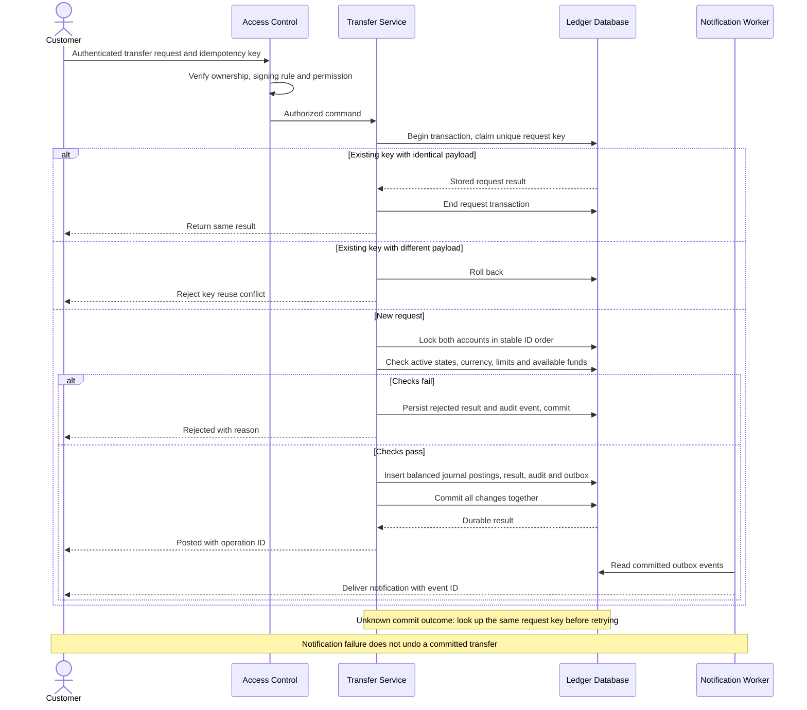

[Diagram source](diagrams/03-transfer-sequence.mmd)

## Loan approval and disbursement

Verification, approval and disbursement are distinct actions. The verifier/disbursement operator cannot approve their own loan case. An approval does not promise that funds have been posted.

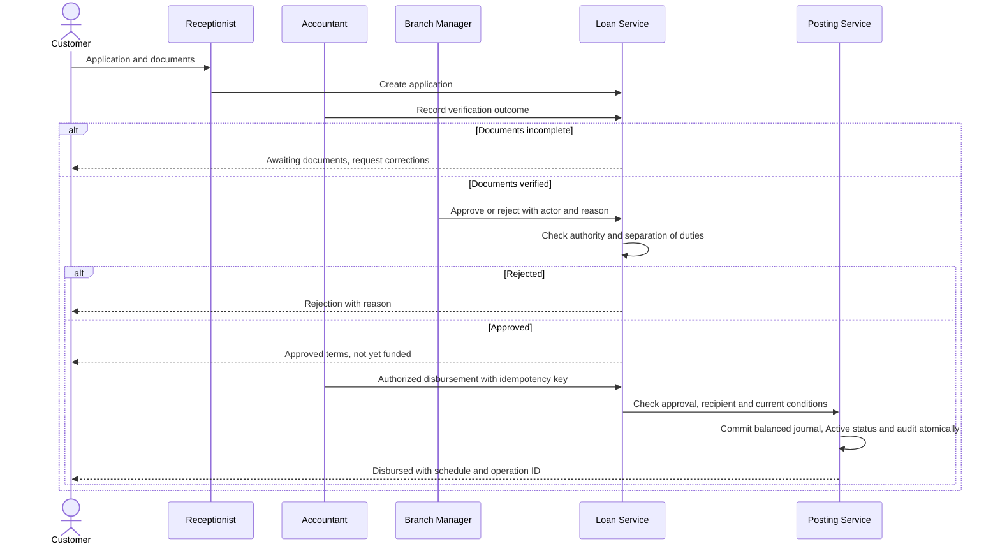

[Diagram source](diagrams/03-loan-sequence.mmd)

## ATM communication view

Numbered edges approximate a UML communication view. A database transaction cannot make physical cash dispensing atomic. Holds and evidence-based reconciliation handle that boundary.

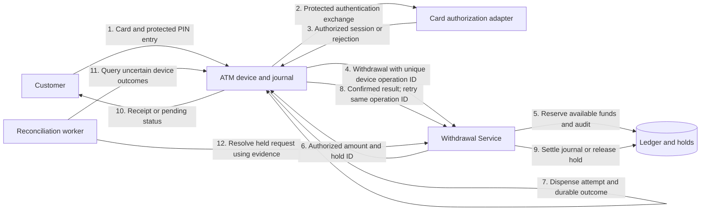

[Diagram source](diagrams/04-atm-communication.mmd)

## Account state machine

Account status gates allowed operations. Available balance includes active holds and applicable overdraft policy. Authentication lockout does not change the account lifecycle.

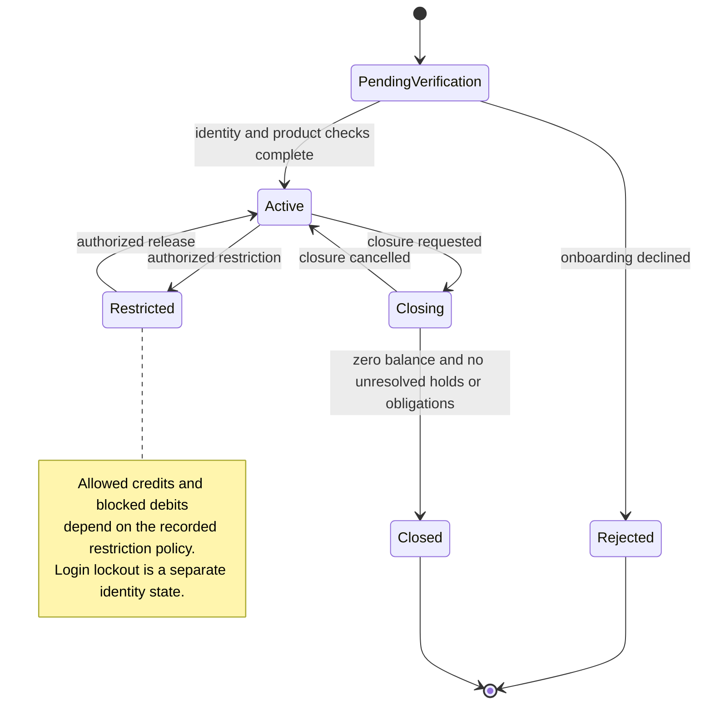

[Diagram source](diagrams/05-account-states.mmd)

## Loan state machine

Overdue thresholds are configured product policies. Write-off requires an explicit decision and does not automatically forgive a debt or end collection. This is a design assumption, not a regulatory rule.

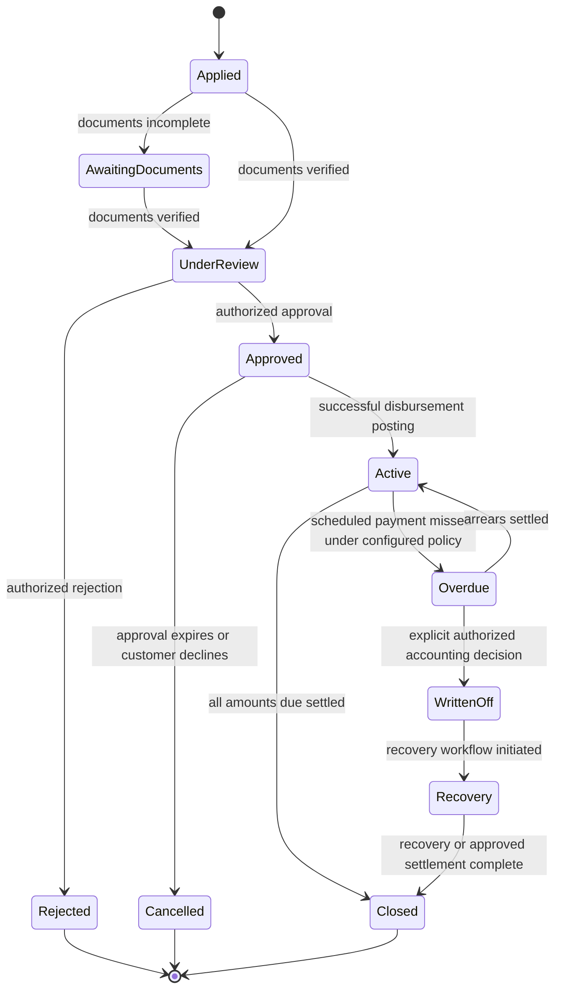

[Diagram source](diagrams/05-loan-states.mmd)

## Cheque state machine

Stop and clearing decisions are serialized against the same cheque record. External settlement needs reconciliation; an ambiguous outcome remains pending instead of being reported as cleared or returned.

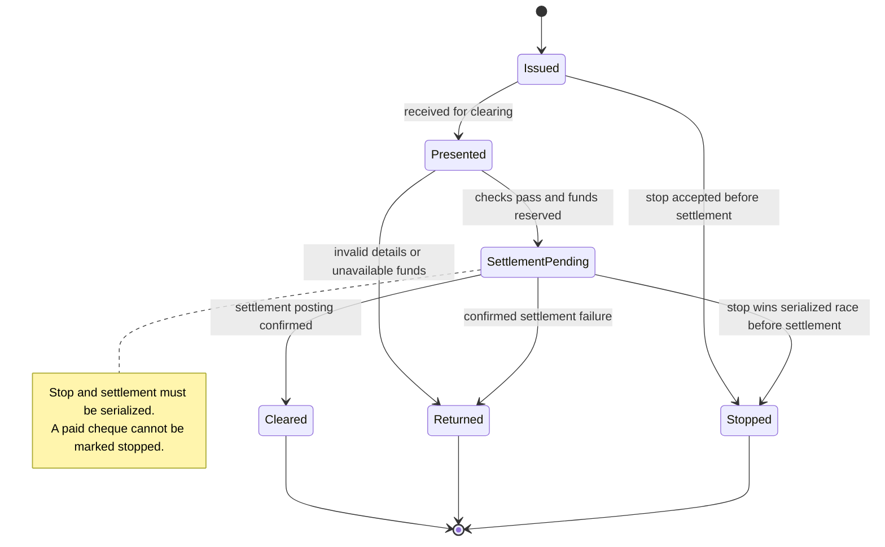

[Diagram source](diagrams/05-cheque-states.mmd)

## ATM withdrawal activity

A timeout is not proof of dispense failure. Retain the pending hold until device evidence resolves it, with an escalation policy for unresolved items. Notification and receipt failures cannot cause a second financial posting.

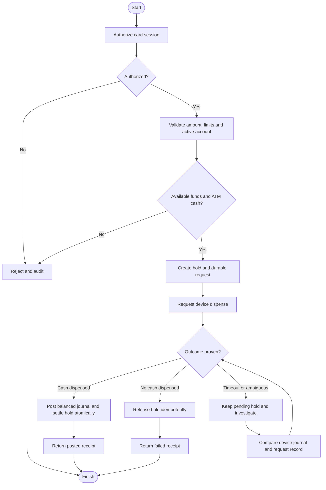

[Diagram source](diagrams/06-atm-activity.mmd)

## Authentication activity

Rate limits, lock duration and extra authentication are policy settings. The old fixed three-attempt account lock is replaced by identity-level controls and recovery. No password or PIN material belongs in logs.

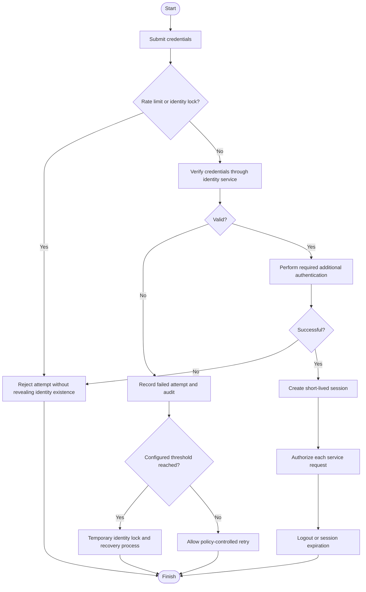

[Diagram source](diagrams/06-login-activity.mmd)

## Component view

Choose a modular application with one transactional ledger database for this teaching design. Authorization is enforced by services as well as the gateway. Only PostingService creates financial journals; workflows persist their own state via repositories.

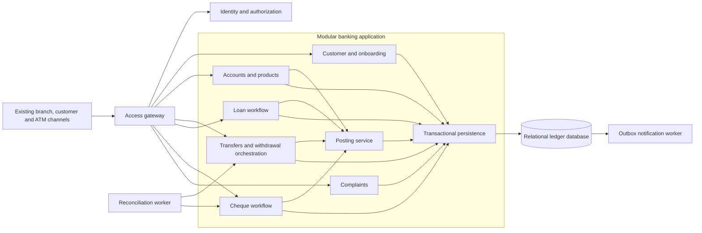

[Diagram source](diagrams/07-components.mmd)

## Deployment view

This is a logical topology, not a deployment manifest or availability claim. Redundancy, failover, backup restoration, key management and recovery objectives require separate infrastructure decisions.

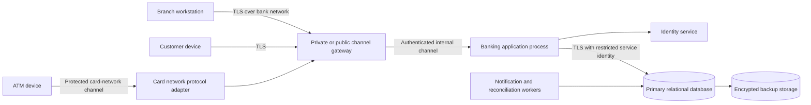

[Diagram source](diagrams/08-deployment.mmd)

## Package dependencies

Domain classes do not depend on persistence or channel code. Infrastructure implements application ports. Existing channels are external context; this repository adds no frontend implementation.

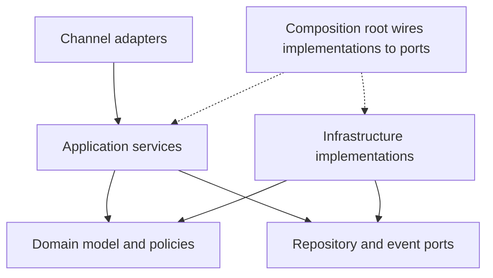

[Diagram source](diagrams/09-packages.mmd)
